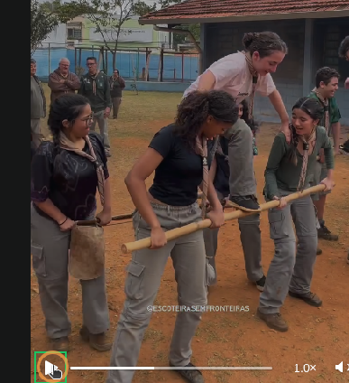
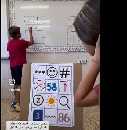
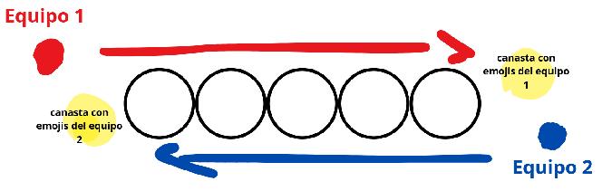
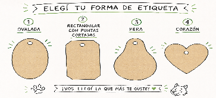
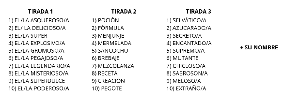
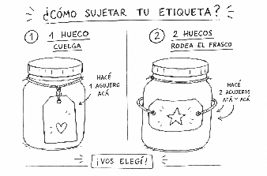

# PAUTAS

# programas_2026

**Primera reunión 19/3/2026**

-equipo e inscriptos   
baloo, bagheera, hermano gris  
akela, sábado de por medio   
posibles: santi 

# inscriptos 

| 7 | 8 | 9 | 10 | no inscriptos |
| --- | --- | --- | --- | --- |
| pauli  **benja   gael  valentin castro francisco dinotto  pia baldessari**   6 | more  augusto  jaco  zarya  nico  **jana mugas**  6 | joaquin  **octavia**  exequiel  **aron allende**  bianca Pablo  nicols moreno) 7 | felipe  beni  bruno  isa  facu  augusto  lisette gian luca  bauti  Matilda  10 | agustino |

total 29  
nuevos: 7+9 y viejos 

-tareas:  
jefe de rama: cande   
afiliaciones: wen  
papeles: cande   
asistencia: cande   
progresiones:hno gris   
comunicación padres: cande y wen  
agregar al calendario de grupo fechas, hno gris  
armar reuniones, seguimiento diario: todos   
quien pasa a la bandera: hno gris  
mantenimiento el cubil y el orden: todos

-pautas de trabajo /forma de trabajo   
leer los nuevos documentos si o si   
dejar todo asentado en el drive  
hacer menos reuniones para programar 

-disponibilidad para reuniones 

| lunes | martes | miércoles | jueves | viernes | sábado p cj de grupo |
| --- | --- | --- | --- | --- | --- |
| wen 20hs | wen 20hs |  |  | wen 20hs | wen: 13 con almuerzo |
|  | Diego 20hs |  | Diego 20hs |  | Diego idem 20hs+asadox |
|  |  |  |  |  |  |
|  |  |  |  |  |  |

-foda 

manada

| fortalezas el equipo tiene ganas y mucho compromiso  nos complementamos bien  la comunicación  buen trato | debilidades  no leímos el documento nos falta innovar y actualizarnos.  falta de tiempo a veces |
| --- | --- |
| oportunidades  posibilidad de ir a la formación | amenazas estamos muy acostumbrados al equipo de trabajo |

-planificación 

# primera etapa

|  | diris | programa | comentario |
| --- | --- | --- | --- |
| sábado 28/3 | cande y diego no (formación) | dinamica de presentacion act para conocerse  7,8 marco simbólico 9,10 |  |
| sábado 04/4 | wen no | marco simbólico:  saludo, lema, cubil, leyes   historias |  |
| sábado 11/4 |  |  |  |
| sábado 18/4 | wen no |  | cjo |
| domingo 25/4 |  | f |  |

## sábado 28/03/2026

wen y tincho. capaz santi.   
Objetivos:

- habilitar el espacio para que los chicos se conozcan  
- introducirlos en el marco simbólico  
- divertirse

| Horario | Actividad | Ejecutor |
| --- | --- | --- |
| 1515 | concentración |  |
| 1530 | concentración |  |
| 1545 | formación grupal |  |
| 1600 | danza |  |
| 16:05 | Dinámica de presentación Y actividad de conocerse |  |
| 1615 | La Ley en accion |  |
| 1630 | Juego temático por grupos wen: nuevos y un par mas tincho: viejos  (Bingo) |  |
| 1645 |  |  |
| 1700 | Merienda |  |
| 1730 | Juego temático |  |
| 1800 |  |  |

**Evaluación** 

* Se empezó tarde como todo primer día. Hubo 24 chicos   
* Los chicos nuevos muy bien, piolas, se adaptaron bien y son desenvueltos  
* Se hizo el juego de la pelota con los nombres, la estrella en el medio para desfogue con agua, se siguió con lo de la ronda con variante. Antes de la estrella Tincho hizo una dinámica del barca para dividir y está buena, los chicos corren un poco con eso de a vapor y a popa y es dinámico y útil como recurso.   
* Después hice el juego de manzana, naranja y banana. Gustó, lo conocían Pero se hizo largo, debi cortarlo un toque antes. Se busco que no sea “eliminativo” sino que después sigan jugando Pero los chicos pidieron q no asiq quizá si hubiésemos sido más los que iban perdiendo seguían jugando por una segunda chance con supervisión y animador del juego.  
* Merendamos   
* Hicimos lo de las huellas y los cuadernos.   
* (El sábado que viene hay que sacarse una foto con el cartel y hay que relevar la info)   
* Y después tuvieron un rato libre hasta la hora de irse. 

| | |
| --- | --- |
| Act. N° | 1 |
| Nombre de la actividad: | Actividad para Conocerse |
| Duración | 35 minutos |
| Competencias a desarrollar |  |
| Área de desarrollo |  |
| Responsable | hno gris y akela? |
| Materiales | pelota planillas para completar lapices |
| Ambientación (si la hay) |  |
| DESCRIPCIÓN DE LA ACTIVIDAD. (Tener en cuenta momentos como: Motivación, Experimentación activa y Recupero.) | **Motivación:**  **Experimentación activa:**  Objetivo: aprender nombres y romper el hielo Duración: 10–15 min Parte uno Primera  ronda El que tiene la pelota dice: “Soy _ y me gusta _” (comida preferida) Luego tira la pelota a otro pero diciendo: “Va para _” (usa el nombre del otro) Opción: que los dos que están al lado del que recibe la pelota se tengan que agachar Después de una ronda: ahora tienen que decir:  nombre + gesto (ej: “Soy Juan” y hace un bailecito) el siguiente repite: “Él es Juan (hacer el gesto ) y yo soy Sofía (otro gesto)   Parte 2 . “BINGO Buscá a alguien que…” (para conocerse más) Objetivo: descubrir cosas en común Duración: 20–25 min Se les da un tiempo para que completen una ficha personal con gustos Luego se van a mover por el predio y se les da consignas y deben encontrar a alguein que cumpla eso Ejemplos (adaptados a esa edad): “Buscá a alguien que le guste el fútbol” “Buscá a alguien que le guste la pizza, milanesa, bla, (porque se lo dijeron al principio)” “Buscá a alguien que tenga mascota” “Buscá a alguien que juege videojuegos” “Buscá a alguien que le guste pintar “Buscá a alguien que nunca haya venido a scout”     * Cuando lo encuentran tienen que hacer un saludo original, choque los 5, bailecito como juego de gemelas o lo que sea  **Recupero / Cierre:**  |

| | |
| --- | --- |
| Act. N° | 1 |
| Nombre de la actividad: | PERSONAJES DE LA SELVA |
| Duración | 30 minutos |
| Competencias a desarrollar | Trabajo en equipo, comunicación, escucha de consignas, conocimiento del marco simbólico, expresión corporal, respeto de normas. |
| Área de desarrollo | Social – Creatividad – Corporal |
| Responsable | AKELA |
| Materiales | Tarjetas con personajes del Libro de la Selva y sus nombres Cinta o sobres para esconder las tarjetas Conos o sogas para marcar la base |
| Ambientación (si la hay) | “La Selva de Seeonee”. Se presenta la actividad como un mensaje de los personajes de la selva que los lobatos deben encontrar. |
| DESCRIPCIÓN DE LA ACTIVIDAD. (Tener en cuenta momentos como: Motivación, Experimentación activa y Recupero.) | Motivación: La Selva de Seeonee está llena de amigos.Baloo, Bagheera, Akela, Raksha y muchos más.Hoy ellos nos dejaron mensajes escondidos en la selva,y solo los lobatos más atentos y rápidos podrán encontrarlos. Pero cuidado… cada personaje se mueve de una manera distinta. **Experimentación activa:** Se divide a la manada en equipos o seisenas. Por el espacio previamente se esconden tarjetas con nombres de personajes (Akela, Baloo, Bagheera, Kaa, Raksha, Hathi, etc.).A la señal, los equipos deben buscar las tarjetas. Cada vez que encuentran una tarjeta, deben leer el personaje y volver a la base moviéndose como ese personaje: Baloo: volver bailando o saltando Bagheera: volver en silencio y sigilosos Kaa: volver arrastrándose como serpiente Hathi: volver caminando pesado como elefantes Raksha: volver cuidando a un compañero Akela: volver caminando en orden y en silencio Gana el equipo que más tarjetas logra llevar a la base. **Recupero:** Al finalizar el juego, todos se sientan en ronda y los Viejos Lobos muestran las tarjetas encontradas y cuentan brevemente quién es cada personaje y qué nos enseña en la selva. Se conversa con los lobatos sobre qué personaje les gustó más y por qué, y se explica que durante el año van a ir conociendo a todos los personajes y aprendiendo de ellos en la Selva de Seeonee. En la Selva de Seeonee nadie crece solo. Akela nos enseña a escuchar, Baloo a aprender jugando, Bagheera a ser valientes, Raksha a cuidar, Hathi a respetar las leyes, Kaa a pensar y observar. Este año nosotros también vamos a aprender muchas cosas juntos en la Manada. |

| | |
| --- | --- |
| Act. N° | 1 |
| Nombre de la actividad: | La Ley en Acción |
| Duración | 30 |
| Competencias a desarrollar | Trabajo en equipo, Comunicación y escucha, Memoria y comprensión, Resolución de problemas, Participación activa |
| Área de desarrollo | Social – Carácter (todavia no me se las nuevas) |
| Responsable | Hermano Gris |
| Materiales | 2 crucigramas grandes (uno por equipo) con artículos de la Ley de la Manada 2 hojas de adivinanzas Fibrones o marcadores Cinta para pegar los afiches |
| Ambientación (si la hay) | Se presenta como un desafío de la selva: la Ley de la Manada se perdió y solo los equipos que trabajen juntos podrán reconstruirla para que la manada vuelva a funcionar correctamente. |
| DESCRIPCIÓN DE LA ACTIVIDAD. (Tener en cuenta momentos como: Motivación, Experimentación activa y Recupero.) | **Motivación:** Se reúne a la manada y se introduce la historia: “La Ley de la Manada es lo que nos guía en cada cacería, en cada juego y en cada momento juntos.  Pero algo pasó… la Ley se rompió en pedazos y se perdió en la selva.  Solo una manada que trabaje unida, que escuche y que piense, va a poder recuperarla.” Se divide al grupo en dos equipos equilibrados y se explican las reglas del juego. **Experimentación activa:**  Crucigrama en posta Cada equipo tiene un crucigrama ubicado a cierta distancia. Solo un participante por equipo puede correr a la vez. El participante corre, lee una consigna o palabra, la memoriza y vuelve al equipo. En grupo deciden la respuesta y otro compañero corre a escribirla. Reglas: No se puede gritar la respuesta desde el crucigrama Se trabaja en equipo para decidir  Adivinanzas en equipo (dinámica similar) Se colocan las hojas con adivinanzas en otro punto. Un participante corre, lee una adivinanza y vuelve. El equipo la resuelve en conjunto. Otro compañero corre a escribir la respuesta. Sistema de puntos: Cada palabra correcta del crucigrama = 1 punto Cada adivinanza correcta = 1 puntos Equipo que termina primero = 3 puntos extra    **Recupero / Cierre:** Se reúne nuevamente a la manada y se realiza una puesta en común breve. Preguntas disparadoras: ¿Qué parte de la Ley les resultó más fácil recordar? ¿Cuál les costó más? ¿Dónde vemos la Ley en lo que hacemos durante el campamento? Se refuerza la idea de que la Ley no es solo algo para memorizar, sino algo que se vive en cada actividad, en el respeto, la ayuda y el compartir. |

## sábado 04/04/2026

No hubo actividad

Sábado 11/04/2026

wen? Cande, Diego y tincho. capaz santi.   
Objetivos:

- habilitar el espacio para que los chicos se conozcan  
- introducirlos en el marco simbólico  
- divertirse

| Horario | Actividad | Ejecutor |
| --- | --- | --- |
| 1530 | concentración |  |
| 1545 | formación grupal |  |
| 1600 | danza |  |
| 16:05 | juego desfogue | diego |
| 1615 | actividad de conocerse: [Bingo](#actividad-para-conocerse) | Hno Gris |
| 1630 | separados por nuevos/viejos. nuevos: [PERSONAJES DE LA SELVA](#personajes-de-la-selva) Viejos: [La Ley en acción](#la-ley-en-acción) | nuevos: Wendy (tal vez) Viejos: Hno Gris |
| 1645 | separados por nuevos/viejos. nuevos: PERSONAJES DE LA SELVA Viejos: La Ley en acción | nuevos: Wendy (tal vez) Viejos: Hno Gris |
| 1700 | Merienda |  |
| 1730 | Juego temático | Cande |
| 1800 |  |  |

### **Juegos de desfogue**

#### **El Tesoro de capucha blanca**

Este es un juego de persecución y relevos por equipos que requiere reflejos rápidos y mucha comunicación.

**Preparación**

**Materiales**: Muchos "tesoros" (pueden ser pañoletas, pelotas de trapo, cds, tasas o trozos de cuerda) y 4 cajas para las bases.

**Espacio**: Un área amplia y despejada.

**Formación**: Divide a la Manada en cuatro equipos. Cada equipo se coloca en una esquina del cuadrado de juego, donde estará su "cubil" (la caja).

**Las Reglas**

En el centro del campo se coloca un gran montón de "tesoros" (debe haber al menos 3 por cada niño).

A la señal de **"¡La selva despierta!",** un lobato de cada seisena corre al centro, toma un solo objeto y lo lleva de vuelta a su cubil.

En cuanto el primer lobato toca la base, sale el siguiente.

**El Giro Divertido**: Cuando se acaben los objetos del centro, el juego ¡no termina! Ahora los lobatos pueden ir a robar tesoros de los cubiles de las otras seisenas.

**Restricciones**: * No se puede defender el cubil físicamente (está prohibido hacer guardia frente a la caja).

Solo se puede robar de uno en uno.

Si un Viejo Lobo grita **"¡Pacto de la Selva**!", todos deben congelarse donde estén. Quien se mueva, debe devolver su tesoro al centro.

**El Objetivo**

Gana el equipo que, tras 5 o 10 minutos de juego intenso, logre tener más tesoros en su cubil. Es un ejercicio excelente para trabajar la estrategia (¿quién roba a quién?) y la honestidad al respetar las reglas de "uno a la vez".

**Tip para Viejos Lobos:** Si ves que el juego se vuelve demasiado caótico, introduce una variante: el lobato que corre debe ir saltando como sapo o haciendo el paso del oso para añadirle dificultad física.

#### **El Despertar de la Selva (El Gran Nudo)**

Este juego transforma a toda la Manada en un solo organismo que debe coordinarse y estar listos para empezar el día, en una formación ideal para juegos y danzas.

**El Objetivo**

Toda la Manada debe desenredarse y formar un círculo perfecto sin soltarse de las manos.

**Cómo se juega**

**El Caos Inicial**: Pide a todos los Lobatos que se junten mucho en el centro, formando una bola apretada y revuelta.

**El Vínculo**: Todos deben cerrar los ojos y extender las manos hacia el centro. Cada uno debe buscar y agarrar dos manos diferentes de dos compañeros distintos.

**Regla de oro:** No pueden agarrar las dos manos de la misma persona, ni la mano de quien tienen justo al lado.

**El Gran Nudo**: Una vez que todos estén enlazados, pueden abrir los ojos. Verán que se ha formado un nudo humano gigante y caótico.

**La Misión**: Sin soltarse nunca de las manos, deben trabajar juntos para estirarse y girar hasta que todos queden formando un círculo amplio.

**Los Desafíos**

Tendrán que pasar por debajo de los brazos de otros, saltar por encima de manos entrelazadas y girar sobre sí mismos.

Si el nudo es muy complejo, pueden terminar en dos o tres círculos entrelazados, ¡y eso también es un éxito!

Si alguien se suelta, "la selva se rompe" y tienen que empezar de nuevo (o el Viejo Lobo puede poner una penitencia divertida, como que todos deban aullar como lobos antes de continuar).

#### **"La Serpiente Kaa"**

este juego es en conjunto y fortalece el trabajo en equipo y cooperación además de agilidad y persecución

1 - Un Lobato empieza siendo la "cabeza" de Kaa. quien debe perseguir a los demás lobatos.

2 - Debe correr y tratar de tocar a otros. Al que toca, se engancha a su cintura o se toman de la mano, uno a uno van formando el cuerpo de Kaa.

3 - El juego termina cuando todos los Lobatos forman una sola fila gigante (el cuerpo de Kaa) corriendo por todo el patio sin romperse.

4 - El reto final es que la "cabeza" intente atrapar a la "cola" de la serpiente, haciendo que todos giren y corran en círculos a toda velocidad.

**JUEGO TEMÁTICO MANADA**

1ra parte

Se divide la manada en cuatro grupos y se pegan en la pared 4 carteles. Cada grupo hará una fila enfrentando el cartel que le corresponda. En el mismo se encontrará uno de los artículos de la ley de la manada desordenado. Haciendo una carrera de relevos deberán ordenar de a una palabra el artículo.

2da parte

Luego la dinámica se repite pero dibujando: en el cartel se pone un enunciado que describe a un personaje específico de la manada. Haciendo una carrera de relevos deberán hacer un solo dibujo entre todos (dibujando un par de segundos cada uno).

Cierre

Se cierra la actividad "evaluando" las leyes ordenadas, pensando en las que falten. Después lo mismo con los dibujos y las cualidades de los personajes

#### **Evaluación**

**Wen** 

Fueron 26chicos.no hicimos el bingo para conocerse. 

Los dos juegos de Diego me aparecieron piola. 

El primero a los más grandes los ví embolados, Bruno Felipe. Por eso dije q no repitamos por 3era vez. Aparte me parece importante cortar el juego cuando aún hay ganas. 

El de la serpiente estuvo divertido. Si hay que estar atentos a sumarle reglas si algo no está funcionando o se hace largo o difícil como lo que hizo hno gris que está bueno. 

La actividad/juego mío de los personales al menos en el equipo que yo tenía re bien, les copo (buscar siempre les copa) 

Y para después el cierre participan. Se pudo introducir un poquito del marco simbólico. 

Pidieron jugar al ameba de personajes creo que se llama así. Así que bien. 

Lo último de Cande me pareció q estaba bueno, lastima el sector por ahí complicaba los caminantes jugando al lado por la distracción y eso. Pero bueno tmb me pareció bien. 

Creo que estuvo bueno esa mancha improvisada para reforzar,.pude preguntarle a cada uno y los nuevos me decían no se ninguna y yo le decía algo q te acuerdes de recién más o menos, no importa que no sea tal cual. Y está piola reforzar por repetición y reforzar jugando

Dato; este sábado al parecer estamos solos, la unidad y caminantes salían a hacer el juego democrático al otro lado. 

[14/4 03:36] wen: Estaría bueno para fin de mes una jornada de manada para poner en común aunque sea la primer parte de los libros. Yo leí el cap 3 y 4. Otro puede leer 1,2.bien como para contarnos y el resto de lo que pueda y así. Son 10 capítulos. 

La ley en acción:  
Salió bien, para los más grandes, fueron completando, Muchos no se acordaban, había solo un par que se las sabían. Hay que reforzar la Ley. 

merienda,

Charla con los que están posarse… todos se quieren pasar, algunos con más urgencia que otros. 

Para este sabado tienen que llevar un lista de las cosas que tienen que mejorar para antes de pasar, además nosotros también le vamos a proponer una lista de la competencias para que alcancen.

| Nicolas | Moreno |
| --- | --- |
| Gianluca Pier | Fioramonti |
| Lourdes Lisette | Vidal Lemos |
| Felipe | Oliverio |
| Augusto | Ortiz De La Fuente |
| Bruno | Iudicello |
| Bautista | Mazzucco |
| Benicio Tomás | Oliva Sosa |
| Facundo | Fino |
| Isabella | Arguello |
| Matilda | Sanchez |

## Sábado 18/04/2026

wen? Cande, Diego y tincho. capaz santi.   
Objetivos:

- introducir a la manada en el marco simbólico  
- saludo y lema

| Horario | Actividad | Ejecutor |
| --- | --- | --- |
| 1530 | concentración |  |
| 1545 | formación grupal |  |
| 1600 | danza |  |
| 16:05 | juego desfogue | Diego |
| 1615 | actividad de conocerse: [Bingo](#actividad-para-conocerse) | Hno Gris |
| 1630 | cuento “los hermanos de mowgli” | Cande |
| 1645 | actividad sobre el marco simbolico separados por grandes/chicos | Tincho/Diego |
| 1700 | actividad sobre el marco simbolico separados por grandes/chicos | Tincho/Diego |
| 1730 | marienda |  |
| 1800 | Juegos | Hno Gris |

**Juego naranja, manzana y banana**

**El Objetivo**

Los participantes deben reaccionar rápidamente a las palabras del guía (Naranja, Manzana o Banana). Quien se equivoque de movimiento o tarde demasiado, queda eliminado o debe cumplir un pequeño reto divertido.

**Cómo se juega**

**Formación**: Todos los participantes se colocan de pie formando un círculo grande, mirando hacia el centro.

**Los Comandos**:

**Manzana**: Todos dan un salto hacia adelante (hacia el centro del círculo).

**Naranja**: Todos dan un salto hacia atrás (fuera del círculo).

**Banana**: Todos dan un giro de 180° sobre su propio eje.

**Dinámica**: El guía empieza a decir las frutas lentamente y luego aumenta la velocidad. El truco está en repetir la misma fruta varias veces o cambiar el ritmo para confundirlos.

**Variantes para aumentar la dificultad**

Si el grupo es muy ágil, puedes probar estas reglas adicionales:

**El Espejo (Acción Inversa):** Cuando el guía dice "Manzana", deben saltar hacia atrás; cuando dice "Naranja", saltar hacia adelante.

**Fruta Prohibida:** Eliges una fruta (por ejemplo, "Pera") que no tiene movimiento. Si el guía la menciona y alguien se mueve, pierde.

**En Parejas**: Los participantes se toman de los hombros y deben saltar coordinados sin soltarse.

**Tips para el guía**

**Ritmo Variable:** Alterna entre decir las frutas muy rápido y hacer pausas largas.

**Confusión Visual:** Tú puedes hacer los movimientos correctos al principio y luego hacer uno equivocado a propósito para ver quién te sigue por inercia.

**Cierre:** Es un juego excelente para descargar energía antes de una actividad que requiera más concentración o para cerrar un bloque de juegos físicos.

| | |
| --- | --- |
| Act. N° |  |
| Nombre de la actividad: | Desafíos de la Selva |
| Duración | 40 minutos |
| Competencias a desarrollar | Trabajo en equipo, Comunicación, Resolución de problemas, Coordinación motriz, Toma de decisiones |
| Área de desarrollo | Habilidades para la vida Paz y desarrollo |
| Responsable |  |
| Materiales | Generales: Cronómetro (celular) Tiza, conos o sogas (para delimitar espacios) preguntas en clave Desafío 1: 2 palos resistentes (escoba o similar) Desafío 2: Hojas impresas con preguntas en clave rejilla (1 por equipo) Plantilla de clave rejilla (una sola grande) Lápices Desafío 3:  10 a 15 pelotas de trapo 1 venda para ojos (para el educador Desafío 4: Hola con la lista de frases |
| Ambientación (si la hay) |  |
| DESCRIPCIÓN DE LA ACTIVIDAD. (Tener en cuenta momentos como: Motivación, Experimentación activa y Recupero.) | **Motivación:** Se presenta a los lobatos como miembros de la manada que deberán superar pruebas inspiradas en la vida de Mowgli para demostrar que pueden actuar como verdaderos lobos de la selva. **“**Mowgli no nació sabiendo vivir en la selva. Tuvo que aprender, confiar en su manada y superar desafíos. Hoy ustedes van a demostrar si están preparados para ser parte de la selva.” Se divide a los lobatos en 2 equipos equilibrados. Cada desafío da puntos Antes de cada prueba deberán resolver un mensaje en clave **Experimentación activa:**  Se realizan los 4 desafíos en orden. **DESAFÍO 1: Rescate en la selva Mensaje previo:**  “¿Quién salva a Mowgli de los Bandar-log?”  Respuesta: Baloo, Bagheera y Kaa **Solo al responder correctamente pueden comenzar. Desarrollo:** Cada equipo elige un integrante que será “Mowgli”. El equipo debe transportar a Mowgli desde la línea de inicio hasta la meta como se muestra en la imagen. Imagen: usn el bordon o colihue, dos se paran uno al lado del otro separados por unso 70cm, el colihue a la altura de los muslos, lo sostienen con las manos y pueden dar un medio paso para apoyar el colihue en el muslo, Mowgli se trepa al colihue y se agarra de lso compañeros, otra pareja se para delante del primer grupo con otro colihue, Mowgli debe pasar al nuevo colihue, la primera pareja se pone delante de la 2da pareja, mowgli pasa de nuevo , y así va avanzando.  **Reglas:** Mowgli no puede tocar el suelo en ningún momento No puede bajarse antes de cruzar la meta Si se cae o toca el suelo → vuelven al inicio Todo el equipo debe cruzar la meta junto **DESAFÍO 2: Código de la selva (rejilla) Desarrollo:** Cada equipo recibe: hoja con mensaje en clave plantilla de rejilla Deben descifrar las preguntas y responderlas (Las preguntas pueden estar sueltas o en una misma hoja.) [preguntas_rejilla.pdf](https://drive.google.com/open?id=1HJGV0ju3Y9cUheeYUjcB4aZLQAgMAiiG) Lapices **Reglas:** Tiempo máximo: 7 minutos Pueden trabajar en equipo Gana el equipo con más respuestas correctas **DESAFÍO 3: La Flor Roja Mensaje previo:**  “¿A qué le temen todos los animales de la selva?”  Respuesta: La Flor Roja **El primer equipo en responder correctamente obtiene 1 punto. Preparación del espacio:** Dibujar 2 círculos: uno interno (2–3 m diámetro) → pelotas uno externo (5–6 m diámetro) → zona de espera **Desarrollo:** El educador se ubica en el centro con los ojos vendados Las pelotas se colocan dentro del círculo interno Los equipos comienzan desde fuera del círculo externo **Reglas:** Deben moverse en silencio Pueden entrar de a uno o varios Si el educador toca a alguien: debe dejar la la pelota en el circulo pequeño salir del área Deben recolectar las peltas (flores rojas) **Duración:** 5 minutos o hasta agotar pelotas **Puntaje:** Equipo con más pelotas = 2 puntos **DESAFÍO 4: Verdadero o Falso en movimiento Mensaje previo:**  “¿Quién protege el ankus del rey?”  Respuesta: Capucha Blanca **Desarrollo:** Se delimitan dos zonas separadas un buen trecho: Zona 1 = Verdadero Zona 2 = Falso El educador lee una frase Cada equipo debe decidir y correr al lado correspondiente **Reglas:** Todo el equipo debe estar en el mismo lado Si hay dudas o división la respuesta es inválida **Puntaje:** 1 punto por respuesta correcta BANCO DE 20 FRASES (V/F) “Akela es el líder de la manada” -  Verdadero “Mowgli aprende solo, sin ayuda” -  Falso “Los Bandar-log obedecen reglas” -  Falso “Bagheera conoce a los hombres” -  Verdadero “Baloo enseña peleando” - Falso “Raksha es una loba protectora” - Verdadero “Shere Khan respeta la manada” - Falso “Kaa ayuda a Baloo y Bagheera” - Verdadero “Los lobos abandonan a Mowgli” - Falso “La Flor Roja es el fuego” - Verdadero “Los animales usan fuego” - Falso “Mowgli entiende a los animales” - Verdadero “El ankus trae problemas” - Verdadero “Los hombres respetan la selva” - Falso “La manada decide en grupo” - Verdadero “Shere Khan es fuerte y sano” - Falso “Los lobos cazan por necesidad” - Verdadero “Mowgli es un lobo real” - Falso “Capucha Blanca protege un tesoro” - Verdadero “Los Bandar-log ayudan a Mowgli” - Falso **Recupero / Cierre:** Se reúne a la manada en círculo. Preguntas guía: ¿Qué desafío fue más difícil? ¿Cuándo trabajaron mejor en equipo? ¿Qué hizo fuerte a la manada hoy? Cierre del educador: “Mowgli no sobrevivió solo.  Aprendió de la selva y confió en su manada.  Hoy ustedes demostraron que cuando trabajan juntos, pueden superar cualquier desafío.” |

| | |
| --- | --- |
| Act. N° |  |
| Nombre de la actividad: | Aventuras de Mowgli |
| Duración |  |
| Competencias a desarrollar | Escucha y comprensión, Trabajo en equipo, Coordinación motriz, Confianza |
| Área de desarrollo | Habilidades para la vida Paz y desarrollo |
| Responsable |  |
| Materiales |  |
| Ambientación (si la hay) |  |
| DESCRIPCIÓN DE LA ACTIVIDAD. (Tener en cuenta momentos como: Motivación, Experimentación activa y Recupero.) | **Motivación:** Se les cuenta que hoy van a ayudar a Mowgli a aprender a vivir en la selva, superando juegos como verdaderos lobatos. No hay competencia, todos son una sola manada, todos colaboran por el bien común. Se sientan en ronda. El educador cuenta (versión corta y actuada): “Un cachorro humano llegó a la selva… era Mowgli.  No sabía cazar, no sabía jugar…  pero la manada lo ayudó.  Hoy ustedes van a ser esa manada.” Preguntas para reforzar la historia que acaban de escuchar “¿Quién era el oso?” “¿Quién era la pantera?” **Experimentación activa:  1. Juego: “Llevar a Mowgli” Preparación:** Se ata una soga entre dos árboles o postes a la altura de la cabeza de los niños. Ellos en equipo deben arreglárselas para que todos cruzan del otro lado. Como puedan. **Objetivo:** cooperación - Deben cruzar todos o el desafío no está cumplido **Desarrollo:** Todos son Mowgli de a uno por vez. Los demás lo ayudan a cruzar por sobre la soga. **Reglas:** Todos ayudan **2. Juego: “Obteniendo la Flor Roja”  Objetivo:** valentía y autocontrol **Desarrollo:** Se marca un círculo Dentro hay pelotas (fuego) Un educador en el centro Los niños: entran a buscar una pelota Si el educador los toca vuelven sin pelota Deben obtener todas las pelotas. **3. Juego: “Cuidado con Shere Khan” Objetivo:** velocidad y trabajo grupal **Desarrollo:** Un educador o niño es Shere Khan El resto está en un lado del campo Deben cruzar al otro lado sin ser tocados Si los tocan: quedan quietos otro compañero puede salvarlos tocándolos **4. Juego: “Escapando de Kaa” Objetivo:** atención y reacción **Desarrollo:** Un educador es Kaa (en el centro) El resto se mueve alrededor Cuando el educador dice: “Kaa duerme” → pueden moverse “Kaa despierta” → deben quedarse quietos Si se mueven → Kaa los atrapó Juegan un rato **Recupero / Cierre:** Se sientan en ronda. Preguntas simples: ¿Qué juego te gustó más? ¿Quién ayudó a Mowgli? ¿Trabajaron como manada? Cierre: “Mowgli aprendió porque no estaba solo.   Tenía amigos, tenía manada…   y hoy ustedes fueron esa manada.” |

Evaluación:

- Fueron 19 chicos  
- la mayor parte del tiempo estuvimos solo 3 educadores y más o menos funcionó.  
- Hicimos el Bingo, salió bien, generó expectativa e interés.  
- Cande contó el cuento de Los hermanos de Mowgli, se sintió bien, contó todo y funcionó para involucrar a la manada en la historia de mowgli.  
- La charla con los que están para pasarse   
- vino un niño nuevo Juan Gomez,   
- Los juegos con los más grandes se hicieron medio rápido, la parte de las claves les costó a algunos, y otros la tienen clara. y faltó un juego. A los más grandes les gusta jugar torpe pero no son violentos.  
- los 4 juegos con los más pequeños, les gustó, estaban interesados.  
- El objetivo de introducir al marco simbólico se cumplió, el del saludo y lema no.

## Sábado 25/04/2026

Wen Cande, Diego y Tincho.  
Objetivos:

- Continuar con el marco simbólico  
- saludo y lema

| Horario | Actividad | Ejecutor |
| --- | --- | --- |
| 1530 | concentración |  |
| 1545 | formación grupal |  |
| 1600 | danza |  |
| 16:05 | juego desfogue | hno gris |
| 1615 | cuento “a definir” | Diego |
| 1630 | cuento “a definir” | Hno gris |
| 1645 | actividad sobre el marco simbólico separados por grandes/chicos | más pequeños (cande) Más grandes (hno gris) |
| 1700 | actividad sobre el marco simbólico separados por grandes/chicos |  |
| 1730 | merienda |  |
|  | Cierre de las actividades de marco simbólico todos juntos: Ronda grande Grandes cuentan qué aprendieron Chicos cuentan su experiencia |  |
| 1800 | Juegos / (Propuesta de actividades | Wendy |

| | |
| --- | --- |
| Act. N° |  |
| Nombre de la actividad: | Desafíos de la Selva II: Mensajes, Ley y Manada |
| Duración |  |
| Competencias a desarrollar | trabajo en equipo, comunicación efectiva, escucha activa, memoria y atención, resolución de problemas, comprensión del marco simbólico. |
| Área de desarrollo | Habilidades para la vida Paz y desarrollo |
| Responsable |  |
| Materiales | Pañuelos (1 por participante + 3 extra) Conos / sogas / marcas para delimitar espacios 10–15 hojas A3, o afiches, lo que sea para dibujar grande. 2 tablas o superficies rígidas, para armar tipo pizarras 3–4 fibrones en buen estado (probarlos antes) Tarjetas con artículos de la Ley con palabras clave resaltadas (posta 2) Tarjetas con frases divididas (posta 3) Lista de frases impresa (posta 4) Cronómetro, util para controlar el tiempo y que no se alargue de más Elementos para marcar postas (mochilas, botellas, aros, etc.) |
| Ambientación (si la hay) | Presentar la actividad como una misión en la selva Usar lenguaje simbólico (manada, selva, mensajeros, ley) |
| DESCRIPCIÓN DE LA ACTIVIDAD. (Tener en cuenta momentos como: Motivación, Experimentación activa y Recupero.) | **Motivación:** Hoy la manada va a enfrentar distintos desafíos de la selva.  Algunos requieren fuerza, otros inteligencia, y otros trabajar juntos. Como Mowgli, van a tener que aprender, comunicarse y confiar en su manada. **Experimentación activa: POSTA 1: Defender la manada de los perros de rojiza pelambre** Marco simbólico (ambientacion): “En la selva, los perros de rojiza pelambre atacan en grupo. Son peligrosos porque no respetan la ley. La manada solo sobrevive si se mantiene unida y se defiende.” Mensaje previo (clave rejilla): ¿Qué hace la manada cuando hay peligro? Respuestas válidas: Se mantiene unida, Se protege, Trabaja en equipo (similares) MODALIDAD 1: GUERRITA SCOUT (si hay espacio) Objetivo: Quitar pañuelos del equipo contrario sin perder el propio. Reglas: Cada participante coloca un pañuelo visible en la cintura (parte trasera o lateral). El pañuelo representa su “vida”. Si le quitan el pañuelo: sale del juego Gana el equipo que: elimina a todos los rivales o tiene más jugadores con pañuelo al finalizar el tiempo Duración: 5 a 7 minutos Reglas de seguridad: acordarlas con los participantes (ejemplos:  No empujar ni agarrar el cuerpo, Si alguien se cae no se le puede quitar el pañuelo, Si alguien dice “paro”  se respeta) Rol del educador: observar seguridad, marcar límites, frenar si se desordena MODALIDAD 2: ESCALPO (si hay poco espacio o se quiere más control) Disposición: Dos filas enfrentadas o en ronda Se llama a 1 participante de cada equipo Objetivo: Sacar el pañuelo del oponente sin perder el propio Reglas:  Solo pueden moverse dentro de un área delimitada Gana quien: saque el pañuelo al otro Dinámica Van pasando todos los participantes Cada victoria suma punto al equipo Duración: 1 min por duelo aprox MATERIALES Pañuelos suficientes (mínimo 1 por niño + 2 o 3 extra) Espacio delimitado (conos, tiza o referencia natural) Tener en cuenta: Frenar si se vuelve muy brusco Recordar “esto no es lucha, es estrategia” Equipos: equilibrar físicamente (muy importante), mezclar edades/fuerzas CIERRE RÁPIDO DE LA POSTA: “¿Ganó el más fuerte o el equipo que mejor trabajó?” “¿Qué hizo fuerte a la manada?” Respuesta que buscás: trabajo en equipo / organización / unidad / estrategia/ protección del grupo **POSTA 2: Pictionary de la Ley** Marco simbólico (para decir antes, mensaje en rejilla): “Baloo le enseñaba la Ley a Mowgli… no con palabras difíciles, sino con ejemplos.   Ahora ustedes van a demostrar si entienden la Ley como verdaderos lobatos.” Objetivo: Reconocer y comprender los artículos de la Ley de la Manada a través de la representación gráfica. Materiales:  10–15 hojas A3 (por si se llenan rápido) 2 tablas o superficies rígidas para dibujar 3–4 fibrones (probados previamente) Tarjetas con los artículos de la Ley (1 por turno) Cronómetro Artículos de la Ley (con palabras clave sugeridas) **Escucha** y **respeta** a los otros **Dice** la verdad Es **alegre** y **amigable Comparte** en familia **Ayuda** a los demás Cuida la **naturaleza** Desea **aprender** Desarrollo: Dos equipos sentados, enfrentados o en semicírculo Zona de dibujo al frente: hojas A3 sujetas a tabla (tipo pizarrón portátil) Educador ubicado entre equipos y zona de dibujo Se llama al primer participante del Equipo 1 El educador le entrega una tarjeta con un artículo El participante tiene unos segundos para leerla Comienza el tiempo (1 minuto) El participante dibuja sin hablar ni escribir palabras Su equipo puede intentar adivinar en cualquier momento Forma de responder para que la respuesta sea válida el equipo debe: ponerse de acuerdo enviar 1 representante decir la respuesta en voz alta al educador No se aceptan gritos desde el lugar Equipo del dibujante tiene 1 intento Si falla, pasa al Equipo 2 (1 intento) Si falla vuelve al equipo inicial Se repite hasta que alguien acierte Esto asegura: que siempre haya punto, que el juego no quede empatado Puntaje: Equipo que acierta → 1 punto Gana el equipo con más puntos Duración: 1 minuto por turno Reglas claras: No hablar ni hacer mímica No escribir letras o números Respetar turnos de respuesta Rol del educador: Controlar el tiempo Validar respuestas Asegurar orden en los intentos Mantener ritmo ágil  Si se traban dibujando: “Pensá en una situación, no en la palabra” Cierre breve de la posta (1–2 min): “¿Cuál fue más difícil de representar?”, “¿Cuál ya están viviendo ustedes?” “La Ley no es para decirla… es para vivirla, como hacía Mowgli en la selva.” **POSTA 3: “Rann, el milano” (mensajeros de la selva)** Marco simbólico (para decir antes, o mensaje en rejilla): “Rann, el milano, llevaba mensajes por toda la selva. Pero un mensaje mal transmitido puede traer problemas. La manada necesita mensajeros atentos y precisos.” Objetivos: Desarrollar, memoria, comunicación, atención, trabajo en equipo Materiales: Elementos para marcar postas (conos, mochilas, botellas, aros etc.) Hojas A3 (las mismas del Pictionary) 2 fibrones Tarjetas o ayuda visual con las frases Desarrollo: Se arma un recorrido tipo “relevo” con 5 puntos: Inicio, Posta 1, Posta 2, Posta 3, Meta (educador + zona de escritura) Las postas deben estar a una distancia corta/moderada para mantener ritmo. Cada equipo:  4 corredores (uno por posta)  1 finalizador (recibe el mensaje completo) Si hay 6 participantes: 1 adicional como backup Si hay más: se agregan más postas al final (repitiendo mensaje completo) Mecánica del juego Cada equipo tiene una frase distinta, dividida en partes. Ejemplo: “La manada”/“es fuerte”/“cuando está”/“siempre”/“unida” Desarrollo paso a paso: Niño 1 (inicio):	memoriza la primera parte corre a Posta 1 Niño 2 (Posta 1): escucha, agrega su parte corre a Posta 2 con el mensaje acumulado Niño 3 (Posta 2): escucha. agrega su parte corre a Posta 3 Niño 4 (Posta 3): escucha, agrega su parte corre al finalizador Niño 5 (finalizador): recibe el mensaje completo Finalización:  Decir la frase completa en voz alta al educador Correr y escribirla en la hoja/pizarrón Gana el equipo que: dice correctamente la frase o en caso de duda la escribe correctamente primero. Reglas: No se puede gritar el mensaje, solo al compañero de posta No se puede volver a una posta anterior Solo corre un participante por equipo a la vez El mensaje debe transmitirse de memoria, sin ayuda externa Cada posta tiene una parte fija, no se inventa Sistema de “backup” (si hay 6 por equipo): El niño 6 conoce la frase completa, solo participa si el equipo falla Corre pasando por todas las postas sin detenerse Entrega el mensaje correcto al niño 5  Desempate: Si ambos equipos fallan gana el que más se acerque a la frase original, si hay duda: piedra, papel o tijera frases (divididas): La manada	/ es fuerte	/ cuando está	/ siempre	/ unida El lobato	/ piensa		/ primero	/ en los		/ demás El lobato	/escucha y	/respeta a	/todos		/siempre Un lobato	/ayuda		/sin esperar	/nada		/a cambio La ley		/guía		/a la		/manada	/siempre Un lobato	/cuida		/la		/naturaleza	/siempre Recupero / Cierre: “¿Qué pasó cuando no escuchaban bien?” “¿El mensaje llegó igual o cambió?” Cerrar:“Rann no llevaba mensajes a medias… los llevaba completos y correctos. En la manada, escuchar bien es tan importante como hablar.” **POSTA 4: “¿Quién lo dijo?”** Marco simbólico (mensaje en rejilla): “La manada se reúne en la Peña del Consejo para escuchar las voces de la selva. Cada frase es una enseñanza… pero hay que saber quién la dijo.” Objetivos:  Reconocer personajes del Libro de la Selva Comprender los valores que representan Relacionar acciones con la Ley de la Manada Materiales: 1 pañuelo (para el centro) Lista impresa de frases (ver al final) Espacio delimitado para el centro Desarrollo: Equipos sentados enfrentados Un pañuelo en el centro El educador lee una frase Corren por el pañuelo Responde quien lo toma No salir antes de que termine la frase Si toma el pañuelo,  debe responder 1 intento por equipo  Lo importante es: personaje correcto contexto correcto Después de que respondan, podés sumar:“¿Por qué lo dijo?” “¿Qué nos enseña eso?”  (solo 1 o 2 veces, no siempre PARA NO EXTENDER) Cierre: “En la selva, cada uno tiene su voz… pero los que escuchan, aprenden.” 20 FRASES (con respuesta y contexto): “El cachorro es mío. Dádmelo.” Shere Khan / Reclama a Mowgli cuando llega a la cueva “Este cachorro es mío, y lo defenderé.”/ Raksha defiende a Mowgli frente a Shere Khan “Yo pagué por él.” /  Bagheera porque entrega un toro para salvar a Mowgli “La ley es para todos.” / Akela en el Consejo de la Roca “Aprende la Ley de la Selva.” /  Baloo enseñando a Mowgli “Los Bandar-log no tienen ley.” / Baloo / Bagheera cuando explican por qué son peligrosos “La selva es grande y tú eres pequeño.” / Baloo enseñanza a Mowgli “La manada es fuerte cuando está unida.” / Akela (idea central del Consejo)  Valor de unidad “No hay caza sin ley.” / Baloo sobre respetar reglas “El miedo es la Flor Roja.” / Mowgli aprendiendo relación con el fuego “Temen al fuego.” / Bagheera explicando el poder de la Flor Roja “Yo cazo al hombre.” /  Shere Khan muestra su naturaleza fuera de la ley “Mira bien, pequeño.” / Kaa antes de hipnotizar a los Bandar-log “Duerman…” / Kaa hipnosis a los monos “Es mi hijo.” / Raksha reafirma vínculo con Mowgli  “No olvides quién eres.” / Bagheera recuerda a Mowgli su origen humano “La ley te protege.” / Baloo enseñanza directa “Los hombres matan por codicia.” /  Mowgli rn “El ankus del rey” “Eso trae muerte.” Kaa / Mowgli (según escena del ankus) Sobre el ankus “Yo soy de la selva, pero no soy un animal.” Mowgli conflicto de identidad **Recupero / Cierre:** Preguntas guía: ¿Qué desafío fue más difícil? ¿Cuándo trabajaron mejor como equipo? ¿Qué cosas de la Ley aparecieron hoy? Cierre del educador: “En la selva no alcanza con ser fuerte. La manada crece cuando escucha, aprende y se mantiene unida.” |

| | |
| --- | --- |
| Act. N° |  |
| Nombre de la actividad: | Desafíos de la Selva I: Jugamos como la Manada |
| Duración |  |
| Competencias a desarrollar | trabajo en equipo, escucha, cooperación, reconocimiento del marco simbólico |
| Área de desarrollo | Habilidades para la vida Paz y desarrollo |
| Responsable |  |
| Materiales |  |
| Ambientación (si la hay) |  |
| DESCRIPCIÓN DE LA ACTIVIDAD. (Tener en cuenta momentos como: Motivación, Experimentación activa y Recupero.) |  |

Juego wen la ley (con cds) 

En una ronda se ubican todos  y adelante tienen un cd, un solo participante que es Mowgli está en el centro. 

El objetivo es que el del centro intente juntar 7 artículos de la ley (los cd) Pero en el mientras los demás trabajando en equipo lo pueden quemar de la cintura para abajo para que no lo consiga. 

Evaluación sabado 25:

- Iniciamos con la rondita para preguntar como andan, que hicieron y eso.  
- Danza, una sola  
- Juegos de wen, el de juntar los CDs estuvo bueno, estuvo bueno meterle marco simbólico.  
- Contamos cuentos, Los perros Jaros, los pude mantener interesados, el cuento La Caza de Kaa también salió bien, fue liviano para los más chicos.   
- La merienda, Hno Gris se encontró solo con los chicos y tuvo que buscar a los demás educadores.   
- Las actividades de los más chicos sobraron dos actividades. Hicieron la de los perros jaros que era con abrazos y les gusto y la de actuar que les gustó y salio bien. Con los mas gande hicimso la del escalpo, el pictionary de la ley, quien dijo que no les gusto tanto porque no sabian casi… 

## Sábado 02/05/2026

Wen Cande, Diego y Tincho.  
Objetivos:

- Sobrevivir  
- saludo y lema

| Horario | Actividad | Ejecutor |
| --- | --- | --- |
| 1530 | concentración |  |
| 1545 | formación grupal |  |
| 1600 | danza |  |
| 16:05 | juego desfogue | todos |
| 1615 | entrega insignias. | Cande |
| 1630 | juego desfogue/marco simbolico | todos |
| 1700 | merienda |  |
| 1730 | propuesta de actividades | hno gris (todos) |
| 1800 | Juegos |  |

### **ENTREGA DE INSIGNIAS**

**ELEMENTOS NECESARIOS:**

* Insignias.  
* Alfileres  
* Mesa o algo que cumpla función de mesa  
* Mantel  
* Decoraciones

**DESARROLLO**

1. **Apertura.**

Abrir la ceremonia con unas breves palabras para:

* explicar el motivo que nos reúne: celebrar nuestro avance y el de nuestros compañeros en su camino por la manada.  
* explicar como siempre de manera sutil que cada uno tiene su momento de recibir sud insignias cuando.  
* enfatizar en que la insignia representa los nuevos desafíos a los que me enfrento y comprometo, además del progreso logrado.

2. **Entrega por progresiones:**

Por orden de progresiones llamamos a cada lobato uno por uno y entregamos la insignia.  
Después se llama al grupo que recibió las insignias de dicha progresión, se dicen las palabras que corresponden y se les saca una foto.

* PATA TIERNA (baloo):  
* SALTADOR (bagheera):  
* RASTREADOR (baloo):  
* CAZADOR (hno gris):

3. **Cierre:**

“Cada uno a su ritmo, cada uno con su forma, todos siguen avanzando. Lo importante no es quién va delante o detrás, sino que vamos juntos, aprendiendo, cuidándonos y dejando huella. ¡Gracias por ser parte de esta gran manada!”  
Se puede cerrar con el gran aullido, el grito de la manada o una canción significativa.

Juego wen (si voy) 

La ka

Todos los participantes están distribuidos en el lugar que delimite para el juego con un cd debajo menos uno que va a ser la kaa y va a ir caminando y cada vez que pasa por al lado de alguien, se suma a la kaa, dejando el cd donde está. 

Al sonido del silbato, o todos al cubil o lo q me salga en el momento, se van a ir todos a un cd, y uno quedará sin, que va a ser la kaa siguiente. 

Para que participen todos en un momento se hace lo mismo con dos ka

EVALUACION

Juegos, la muralla china, tener enc cuenta que no debe quedar un  solo ganador.

piedra papel tijera humano, les gusto a todos menoas a nico porque perdio.

el juego de los aros, tener cinta para que no se desarmen.

piedra papel tijera 1v1, que les gusto tambien.

- problema de bullying a Gian y more, hay que hablarlos a todos para que no se molesten entre ellos.

Entrega de INSIGNIAS: Salió bien, de 10, estuvo bien decorado, hubo materiales e insignias necesarias, la estructura de dividirnos las entregas estuvo bien.

Se entregaron:

- 4 insignias de pata tierna (Jana, Luisiana, Benja, Gael)  
- 4 insignias de saltador (Maria Pia, Camilo, Juan, Jaco)  
- 5 insignias de rastreador (octavia, morena, zarya, pablo, felipe, beni)  
- 7 insignias de cazador (beni, nico moreno, felipe, lisette, bruno, exe, gian)

total = 20 insignias  
Deuda : $15000

Quedaron sin entregar:

- Pata tierna: Francisco Ramos Dinoto y Valentin Castro (no sé quienes son)  
- Saltador: Nicolas Gonzalez (no fue)  
- Rastreador:   
  - Joaquin Pereyra (no fue),   
  - Aaron Allende (nuevo, no sé si algunas vez fue),   
  - Augusto Garcia (no fue), tiene registrado solo pata tierna, pero ya tiene edad para Rastreador. Entregarle Saltador y la próxima (tal vez) Rastreador.

QUedaron desfasados a propósito:

- Benjamin Ochoa, Jana Mugas y Luisiana Falcón se le entregó pata tierna, son nuevos/as la próxima se le entregará (tal vez) la de Saltador.  
- Bianca, por un día. se entregó el 2 de mayo, el 3 de mayo ya cumple 8 años y 9 meses y le corresponde (en teoría) la de Rastreador, Se le entregará en la próxima.

## Sábado 09/05/2026

Cande, Diego y Tincho (Wendy)  
Objetivos:

- comenzar con el ciclo de programa  
- propuesta de actividades  
- juego demoscratico

| Horario | Actividad | Ejecutor |
| --- | --- | --- |
| 1530 | concentración |  |
| 1545 | formación grupal |  |
| 1600 | danza |  |
| 16:05 | juego desfogue | todos |
| 1615 | Propuesta de actividades |  |
| 1630 | juego | todos |
| 1700 | merienda |  |
| 1730 | Juaego democratico | todos |
| 1800 | Juegos |  |

| | |
| --- | --- |
| Act. N° |  |
| Nombre de la actividad: | juego democratico: el mapa de la selva de seoane???? |
| Duración | 1 hora (15 min por posta) |
| Competencias a desarrollar |  |
| Área de desarrollo |  |
| Responsable | todos |
| Materiales | 4 mapas (Cande), huellas( Cande) |
| Ambientación (si la hay) | según la estación |
| DESCRIPCIÓN DE LA ACTIVIDAD. (Tener en cuenta momentos como: Motivación, Experimentación activa y Recupero.) | **objetivo:** Que la Manada pueda elegir y priorizar actividades, aprendizajes, salidas y desafíos para el año a partir de las propuestas que surgieron previamente en las fichas individuales.  **Motivación:** “Muchos lobatos y lobeznas dejaron sus ideas para este año. Ahora la Selva necesita decidir qué caminos quiere recorrer primero.” Se presenta un gran “Mapa de la Selva” dividido en territorios y quiza podemos marcar los recorridos por seisena. y hacer 4.  Aventuras y salidas actividades Servicio y buenas acciones otros jajajaj  Cada seisena rota por las estaciones. En cada una: recuerdan propuestas que aparecieron en las fichas,juegan algo breve, y votan **Experimentación activa:** estación 1: el estanque de bagheera (que en el mapa haya tipo un estanque) (Salidas y aventuras) Actividad/juego: Deben superar un mini campo de hercules con pequeños desafíos físicos (embocar, pasar obstáculos, etc.).                                                                                                                              Decisión: Cada chico recibe 2 huellas y las coloca en las actividades que más le entusiasman. votación en el afiche estarán escritas  todas las actividades. Sea de buena acción, de actividades etc. La votación será en privado. Ganan una huella y escriben adentro lo que elijan y se la dejan al educador. Las actividades son solo para que las miren y sepan sobre que votan esto es así para evitar influenciarse con votaciones del otro o desmotivarse porque no está saliendo la actividad que yo quiero y da más sorpresa. estacion 2: La Cueva de Baloo“La historia perdida de la Buena Acción” Ambientación Baloo les cuenta que una antigua historia de la Selva se rompió en pedazos y la Manada debe reconstruirla para recordar por qué los scouts hacen Buenas Acciones. Mini juego: Preparás tarjetas mezcladas: algunas con dibujos, otras con fragmentos cortos de la historia. actividad / juego: La seisena tiene que  En una carrera de relevos, de a dos y atados por el pie seguir un camino y sortear algún obstáculo para conseguir la tarjeta con el fragmento de la historia. La idea es ayudarse entre sí y trabajar en equipo. Al final cada uno recibe una huella que va a usar para escribir su voto.  estacion 3: …………… (actividades)  Actividad/juego: Hermano Gris mezcló los recuerdos de las mejores actividades que hemos hecho  en la Manada. En dos equipos  deben observar durante unos segundos un tablero con imágenes/símbolos de distintas actividades. Luego, corren hasta el otro lado y deben replicarlo correctamente dibujando lo.   Cuando lo logran ganan la huella y proceden a la decisión  Decisión:  en el afiche estarán escritas  todas las actividades. La votación será en privado. Con huella escriben adentro y se la dejan al educador. Las actividades son solo para que las miren (esto es así para evitar influenciarse con votaciones del otro o desmotivarse porque no está saliendo la actividad que yo quiero y da más sorpresa.  Materiales  Dos afiches los hace Cande  Hojas borradores con la cuadrícula hecha  Afiche con las actividades a votar  Huellas las hace Cande  votación en el afiche estarán escritas  todas las actividades. Sea de buena acción, de actividades etc. La votación será en privado. Ganan una huella y escriben adentro lo que elijan y se la dejan al educador. Las actividades son solo para que las miren y sepan sobre que votan esto es así para evitar influenciarse con votaciones del otro o desmotivarse porque no está saliendo la actividad que yo quiero y da más sorpresa estacion 4: dibuja y adivina (Talleres y habilidades) Actividad/juego: Se divide a la manada en 2 o 3 equipos. En un bolso o caja se colocan papelitos con palabras o frases cortas relacionadas a la vida scout: nudos, fogón, huella, respeto, amistad, "buena acción del día", animales, elementos de la naturaleza, señales de pista. Por turnos, un integrante de cada equipo saca un papelito y tiene 1 minuto para dibujarlo en un afiche o pizarrón sin usar números ni letras. Su equipo debe adivinar antes de que se acabe el tiempo. Cada acierto vale 1 punto. Gana el equipo con más puntos. Hay dos listas de palabras para más chicos y para más grandes.  votación en el afiche estarán escritas  todas las actividades. Sea de buena acción, de actividades etc. La votación será en privado. Ganan una huella y escriben adentro lo que elijan y se la dejan al educador. Las actividades son solo para que las miren y sepan sobre que votan esto es así para evitar influenciarse con votaciones del otro o desmotivarse porque no está saliendo la actividad que yo quiero y da más sorpresa **Recupero / Cierre: hacemos el recuento con los chicos   aclaraciones  primera etapa lo de la planilla, en la merienda recolectamos lo más repetido y hace cada uno el papel con las de su área, sea actividad, buena acción etc. y ya luego se hace el juego** |

evaluación 

el primer juego salió re bien, gusto. 

el juego democratico salio bien pero a las apuradas. algunos juegos se simplificaron para hacer foco en la votación. pero los juegos estaban buenos. 

en la lluvia de ideas reforzar que piensen cosas que sean desafíos, juegos no van. el error quizá fue que no estuvimos ahi encima y chequeando eso. 

estuvo bien usar números y que voten números para más facilidad y agilidad.

lo de la votación individual estuvo muy acertado porque no se influenciaron en los votos como si lo vieran pegados. 

### **Actividades Elegidas**

| salidas diego | actividades dario | buenas acciones | otras ideas wen |
| --- | --- | --- | --- |
|  | 4 votos: Hacer Dulce 3 votos: Caminata 3 votos: Taller de magia 2 votos: Taller de Nudos, Manualidades, usar carpas, fiesta temática, cocinar | 11 votos ayudar a los animales | 10 votos jugar videojuego  7 votos andar en bici  7 votos ver y estar con animales  y les dije que fiesta de disfraces se va a hacer (podemos hacer la de me equivoque de lugar jajaajja) y noche de cine tambien (por que si se hace acantonaiento siempre se hace esa) |

## Sábado 16/05/2026

Cande, Diego y Tincho (Wendy)  
Objetivos:

- Presentacion de actividades seleccionadas  
- introduccion a la buena accion  
- sobrevivir y pasar una linda tarde

| Horario | Actividad | Ejecutor |
| --- | --- | --- |
| 1530 | concentración |  |
| 1545 | formación grupal |  |
| 1600 | danza |  |
| 1615 | juego de desfogue: escalpo 1v1 guerrita scout juego de colectar objetos (vemos como enganchan cada uno) |  |
| 1630 | actividad de la buena accion y termina con la historia de la buena accion contada con mistica y la forma de contar historias en la manada. (esto deberiamos hacerlo a resguardo, en el cubil o en el salon) | Cande / Tincho |
| 1700 | merienda |  |
| 1730 | Presentacion de Actividades. con suspenso y chachara vamos presentando las actividades más votadas. | todos |
| 1800 | Juegos simples de correr y divertirse. |  |

[https://meet.google.com/xor-szcm-bwv](https://meet.google.com/xor-szcm-bwv)

evaluación del sabado   
fueron 10 chicos nomas. se suspendió la convivencia.   
la pasaron bien, esta bueno acostumbrarse a que las condiciones no son las mejores y se puede tener actividad igual.   
a nivel grupo se ve como que a la primera chance se quiere suspender.  
tincho armó el programa rápidamente,los juegos salieron bien, y fue el sábado tranquilo y bueno. 

## Sábado 23/05/2026

Cande, Diego y Tincho  wendy no va  
Objetivos:

- Presentacion de actividades seleccionadas  
- trabajar la ley 

| Horario | Actividad | Ejecutor |
| --- | --- | --- |
| 1530 | concentración |  |
| 1545 | formación grupal |  |
| 1600 | danza |  |
| 1615 | juego de desfogue: | diego |
| 1630 | actividad ley en dos grupos  hacer un listado promesado/no promesado | Cande / Tincho |
| 1700 | merienda |  |
| 1730 | Presentacion de Actividades. con suspenso y chachara vamos presentando las actividades más votadas. | todos |
| 1800 | Juegos simples de correr y divertirse. | diego |

| salidas diego | actividades dario | buenas acciones | otras ideas wen |
| --- | --- | --- | --- |
| parque acuático museo  cine  parque/plaza | 4 votos: Hacer Dulce 3 votos: Caminata 3 votos: Taller de magia 2 votos: Taller de Nudos, Manualidades, usar carpas, fiesta temática, cocinar | 11 votos ayudar a los animales | 10 votos jugar videojuego  7 votos andar en bici  7 votos ver y estar con animales   y les dije que fiesta de disfraces se va a hacer (podemos hacer la de me equivoque de lugar jajaajja) y noche de cine tambien (por que si se hace acantonamiento siempre se hace esa) |

# calendario

|  |  |  |
| --- | --- | --- |
| mayo 30  hacer dulce  junio sábado 6 convivencia? sábado 13   sábado 20  cine? sábado 27- no va wen | julio sábado 4: cumple del grupo sab 11 receso  sábado 18 receso sábado 25 acantonamiento? | agosto  sábado 1  sábado 8 preparacion  sábado 15 campa   sábado 22 animales? sábado 29 |

POSIBLES DIVISIONES PARA ACTIVIDAD LEY

+CHICOS Y + GRANDES

| PATA TIERNA / SALTADORES (Baloo) | RASTREADORES / CAZADORES (Hno Gris) |
| --- | --- |
| Cristal Gael Paulina Benjamín Augusto Campos Jaco Nico Gonzalez María Pía Jana Bianca Juan Luisiana Camilo Joaquín | Benicio Bruno Isabella Felipe Augusto Ortiz Nico Moreno Morena Facundo Exequiel Gianluca Zarya Bauti Octi Lisette Pablo |
| *Los que están en verde están registrados en una etapa perteneciente a los más chicos pero deberían estar en rastreadores o cazadores |  |

PROMESADOS / NO PROMESADOS

| NO PROMESADOS (Baloo) | PROMESADOS (Hno Gris) |
| --- | --- |
| Nico Moreno Gian Octi Pauli Jaco Nico Gonzalez Joaco Cristal Gael Benja Augusto Campos María Pía Jana Bianca Juan Luisiana Camilo | Benicio Bruno Isabella Felipe Augusto Ortiz Morena Facundo Exequiel Zarya Bauti Lisette Pablo Joaquin |
| *Los que están en amarillo no estoy 100 segura porque no hay o no encontré registro. |  |

Juegos de desfogue

El Tesoro de capucha blanca

Este es un juego de persecución y relevos por equipos que requiere reflejos rápidos y mucha comunicación.

Preparación  
Materiales: Muchos "tesoros" (pueden ser pañoletas, pelotas de trapo, cds, tasas o trozos de cuerda) y 4 cajas para las bases.  
Espacio: Un área amplia y despejada.  
Formación: Divide a la Manada en cuatro equipos. Cada equipo se coloca en una esquina del cuadrado de juego, donde estará su "cubil" (la caja).

Las Reglas  
En el centro del campo se coloca un gran montón de "tesoros" (debe haber al menos 3 por cada niño).

A la señal de "¡La selva despierta!", un lobato de cada equipo corre al centro, toma un solo objeto y lo lleva de vuelta a su cubil.  
En cuanto el primer lobato toca la base, sale el siguiente.

El Giro Divertido: Cuando se acaben los objetos del centro, el juego ¡no termina! Ahora los lobatos pueden ir a buscar tesoros de los cubiles de los otros equipos.  
Restricciones: * No se puede defender el cubil físicamente (está prohibido hacer guardia frente a la caja).

Solo se puede sacar un objeto a la vez.  
Si un Viejo Lobo grita "¡Pacto de la Selva!", todos deben congelarse donde estén. Quien se mueva, debe devolver su tesoro al centro.

El Objetivo  
Gana el equipo que, tras 5 o 10 minutos de juego intenso, logre tener más tesoros en su cubil. Es un ejercicio excelente para trabajar la estrategia (¿quién le saca a quién?) y la honestidad al respetar las reglas de "uno a la vez".

Tip para Viejos Lobos: Si ves que el juego se vuelve demasiado caótico, introduce una variante: el lobato que corre debe ir saltando como sapo o haciendo el paso del oso para añadirle dificultad física.

| | |
| --- | --- |
| Act. N° |  |
| Nombre de la actividad: | LA LEY OLVIDADA |
| Duración | 30 MIN |
| Competencias a desarrollar | Comprensión del marco simbólico, comprensión de consignas, escucha atenta, comunicación y reflexión, trabajo en equipo. |
| Área de desarrollo | Habilidades para la vida, paz y desarrollo |
| Responsable | Cande |
| Materiales | Aros aprox 10/15, una canasta o contenedor con emojis de papel (5 por ley) |
| Ambientación (si la hay) | - |
| DESCRIPCIÓN DE LA ACTIVIDAD. (Tener en cuenta momentos como: Motivación, Experimentación activa y Recupero.) | **Motivación:** La ley quedó olvidada y eso hizo que poco a poco se desordene y se pierda. Hay que recordarlas, buscarlas y ponerlas nuevamente en práctica para que no vuelvan a perderse. Preguntar a los chicos qué conocen sobre la ley, por qué creen que es importante, qué tiene que ver con la manada. Generar un momento de charla corta que saque las primeras ideas y preguntas. **Experimentación activa:** Se divide a los chicos en dos grupos. En un camino formado por aros, van avanzando uno a uno los dos grupos al mismo tiempo (enfrentados uno a otro) cuando se cruzan deben hacer piedra papel o tijera y ganar para poder seguir adelante, si pierdo vuelvo a mi fila. Una vez que lleguen a la “base”del equipo contrario sacan de una canasta un papel con un emoji, luego vuelven al final de su fila.  Es importante que los chicos sepan que los emojis que logren recolectar pertenecen al grupo. Cuando hayan conseguido todos los emojis, deben ser solidarios y repartir a quienes no han conseguido uno para que todos puedan participar de la puesta en común. **Recupero / Cierre:** Se presenta un afiche o cartel con las leyes escritas, a cada ley le corresponden 5 emojis. Cada uno muestra su emoji y dice a qué ley piensa que pertenece. ej: un libro o lupa, “desea aprender”. Y algún momento donde la llevamos a cabo. Cierre con algunas preguntas para reflexionar. |

evaluación del sabado 23  
fueron 16 chicos, poco para haber sido un día lindo… hay varios enfermos y Cristal no se quiso quedar.  
Juego de incio el de diego que habia que robar los tesoros… estuvo bueno  
nos separamos en dos grupos, Cazadores/los demás.  
actividad de cande: piedra, papel, tijera con las imagens de la ley. Participaron y aprendieron la ley que era el objetivo. revisar tiempos.   
actividad de hermano gris: con cazadores, el objetivo de entender como aplicar los artiiclos funciono, no asi el que tenian que aplicar la ley completa.   
emrendamos mate cocido y presentamos las actividades elegidas similar al sabado anterior.  
juego final de diego: pato al agua/a la tierra, les divierte 

## Sábado 30/05/2026

Cande, Diego y Tincho  wendy no va  
Objetivos:

- Trabajar como manada  
- hacer mermelada  
- poner en práctica la Ley

| Horario | Actividad | Ejecutor |
| --- | --- | --- |
| 1530 | Concentración |  |
| 1545 | formación grupal |  |
| 1600 | Preparación de fruta | Hno gris |
| 1615 |  |  |
| 1630 | juego de desfogue | Wendy |
| 1700 | merienda |  |
| 1730 | preparar la etiqueta | Cande |
| 1800 | repartir dulce y cerrar la actividad |  |

| | |
| --- | --- |
| Act. N° |  |
| Nombre de la actividad: | “La Mermelada de la Manada” |
| Duración | 1hr |
| Competencias a desarrollar | Trabajo en equipo. Cooperación. Participación activa. Organización y responsabilidad. Comunicación y escucha. Resolución práctica de tareas cotidianas. |
| Área de desarrollo | Habilidades para la vida Paz y desarrollo |
| Responsable | Hno Gris |
| Materiales | se le pide a cada lobato/a: pelapapas. cuchillo pequeño sin punta o cuchillo de mesa. plato playo, bowl o pequeña tabla para apoyar/cortar. repasador o trapo de cocina. frasco limpio con tapa ropa que se pueda ensuciar TODO CON NOMBRE Para preparación de alimentos:  Peras Azúcar. Limones. Fuente o recipiente grande para juntar la fruta. Balanza pisapapas (para aplastar la fruta en la olla si hiciera falta) Ollas para cocción (uso exclusivo de adultos). Para trabajo de los chicos: Pelapapas. Cuchillos pequeños sin punta o de mesa. Plato playo o tablas para cortar. Fuentes o bowls. Coladores (para el lavado) Paños o rollos de cocina. Bolsas para residuos. Higiene y organización: Agua. Jabón. Repasadores. Mesas. Para la Cocción: Anafe Garrafa cuchara grande de madera platito manoplas por si hay que agarrar la olla caliente Para el cierre: Frascos limpios Etiquetas o fibrones (opcional). |
| Ambientación (si la hay) | La Manada se convierte en una gran cocina comunitaria donde cada lobato y lobezna tiene una tarea importante para lograr un objetivo común: preparar entre todos una mermelada hecha por la Manada. La idea principal es transmitir que:  “Así como en la Manada cada uno aporta algo distinto, en esta receta todas las tareas son importantes para lograr algo rico y hecho en comunidad.” |
| DESCRIPCIÓN DE LA ACTIVIDAD. (Tener en cuenta momentos como: Motivación, Experimentación activa y Recupero.) | **Motivación:** Se reúne a la Manada y se presenta el desafío: “Hoy vamos a hacer algo distinto: cocinar entre todos una mermelada de pera. Pero para que salga bien, necesitamos organizarnos, ayudarnos y trabajar como verdadera Manada poniendo en práctica la Ley de la Manada. Nadie puede hacer todo solo. Algunos lavarán, otros pelarán, otros cortarán… y cada tarea será importante para que la receta salga bien. Puede no salir bien… pero siempre tenemos que tener la seguridad de haber dado lo mejor de nostros.” **Se muestran los materiales y se explican:** las normas de higiene, el cuidado con utensilios, y la importancia del orden y la colaboración. Luego se divide a la Manada en grupos pequeños para trabajar por estaciones. **Experimentación activa: Organización general** La actividad se desarrolla mediante estaciones rotativas para evitar desorden y permitir mayor acompañamiento de los adultos. Un adulto por estación para cuidar, acompañar y explicar. **Estación 1 – Lavado** Los chicos lavan cuidadosamente las peras, si es posible le sacan el palito y partes feas y las dejan listas para el siguiente grupo. orden, higiene, responsabilidad. **Estación 2 – Pelado** Los chicos pelan las peras y le quitan el palito y partes feas utilizando pelapapas o utensilios seguros, acompañados por un adulto. paciencia, cuidado, colaboración. **Estación 3 – Corte** Los chicos cortan las peras en trozos pequeños y las colocan en una fuente común. Coordinación, organización, trabajo compartido. **Preparación final (adultos)**  Cuando toda la fruta está lista: un adulto pesa o calcula la cantidad, agrega azúcar y limón, mezcla la preparación, y comienza la cocción. Si es posible se explica este proceso a la manada. Se ordena y limpia. La cocción queda a cargo exclusivo de los adultos. Receta base – Mermelada de pera de la Manada Ingredientes:  Por cada 1 kg de pera ya pelada y cortada: 600 g de azúcar Jugo de 1 limón mediano **a chequear** Canela (opcional) Preparación: Preparar la fruta. Lavar, pelar y cortar las peras en cuadraditos o trozos pequeños. Mientras más pequeños sean los trozos, más fácil será cocinarlos. Mezclar ingredientes. Colocar las peras ya preparadas en una olla o cazuela grande y agregar: el azúcar, el jugo de limón, y opcionalmente un poco de canela. Cocción: Cocinar a fuego medio-bajo durante aproximadamente 1 hora.Durante la cocción:  remover cada tanto, controlar que no se pegue, y vigilar la textura. La mezcla irá largando líquido al principio y luego comenzará a espesar lentamente. Textura: Al retirar la mermelada del fuego puede parecer algo líquida, pero espesará más cuando se enfríe. Si se desea una textura más suave, se puede triturar una parte con batidora de mano. Envasado. Cuando la mermelada esté lista y un poco más fría, colocar en frascos limpios. Importante La pera tiene mucha agua, por lo que la preparación puede quedar: más tipo mermelada, o más tipo dulce suave. Ambas opciones están bien y forman parte del proceso casero. **Recupero / Cierre:** Se reúne nuevamente a la Manada al frente de la preparación y se realiza un cierre breve. Preguntas posibles: ¿Qué tarea les gustó más? ¿Fue importante que todos colaboraran? ¿Qué pasaba si alguien no hacía su parte? ¿Qué fue lo más difícil de trabajar en grupo? ¿Qué ayudó a que salga bien? Cierre: “Hoy hicimos algo simple, pero importante: trabajamos juntos para crear algo entre todos. Así funciona también la Manada: cada uno aporta algo distinto y, cuando colaboramos y nos ayudamos, logramos cosas mucho mejores que solos.” |

**ACTIVIDAD ETIQUETAS**  
Materiales: 

* etiquetas pre cortadas de 4 formas diferentes  
* diferentes hilos o lanas para atar la etiqueta al cuello del frasco  
* perforadora  
* lapices de colores  
* 3 dados o dado virtual para poder usar más números.

Competencias: creatividad, gestionar materiales entre varios, compartir.

Desarrollo  
divididos en dos o 3  grupos:

1) eligen la forma de etiqueta que  más les guste, que haya 4 formas para que tampoco se vuelvan locos (pera, rectangular, ovalada, corazón)  
     
2) ¡a pintar y decorar! pintan el fondo y lo decoran. Todo dibujando porque tampoco hay tanto tiempo.  
3) usan la plantilla de nombres locos para poner de manera aleatoria un nombre para su frasco de dulce.  Son tres tiradas en las cuales obtendrán dos adjetivos y un sustantivo para crear un nombre loco. Cada uno va a hacer sus tres tiradas de una vez, y en caso de que algo no le guste puede volver a hacer esa tirada, pero lo importante es que sea lo más aleatorio posible.  
     
     
4) colgar sus etiquetas del cuello del frasco con el hilo que más les guste.

## Sábado 13/6/2026

Cande, Diego y Tincho  (wen capaz va mas tarde)  
Objetivos:

- Prepararnos para disfrutar la salida al cine aprendiendo y practicando aquellas actitudes que nos ayudan a movernos en grupo, cuidarnos entre todos y comportarnos responsablemente en espacios compartidos.

| Horario | Actividad | Ejecutor |
| --- | --- | --- |
| 1530 | Concentración |  |
| 1545 | formación grupal |  |
| 1600 |  |  |
| 1615 | juego desfogue | bagheera |
| 1630 | actividad preparatoria | hermano gris |
| 1700 | merienda |  |
| 1730 | dinamica de grupo? | wen |
| 1800 | juego desfogue | baloo |

| | |
| --- | --- |
| Act. N° |  |
| Nombre de la actividad: | lobatos y lobeznas en los pueblos de los hombres |
| Duración |  |
| Competencias a desarrollar | Escucha activa. Trabajo en equipo. Autocontrol. Respeto por las consignas. Organización grupal. Responsabilidad individual dentro de un grupo. |
| Área de desarrollo | Paz y Desarrollo Habilidades para la vida |
| Responsable |  |
| Materiales | Hoja de consignas Pelotas |
| Ambientación (si la hay) | La Manada se prepara para una misión especial. Pronto realizará una salida fuera del cubil y deberá demostrar que puede comportarse como una verdadera Manada en espacios compartidos con otras personas. "Cuando salimos al mundo representamos a toda la Manada. Debemos aprender a movernos juntos, escuchar, respetar a los demás y cuidarnos entre todos." |
| DESCRIPCIÓN DE LA ACTIVIDAD. (Tener en cuenta momentos como: Motivación, Experimentación activa y Recupero.) | **Motivación:** Se reúne a la Manada en círculo. Se conversa brevemente sobre situaciones en lugares públicos: cine, hospital, escuela, iglesia, museo, transporte público. Preguntas posibles (segun como vengamos de tiempo): ¿Podemos correr por cualquier lado? ¿Podemos gritar? ¿Qué pasa si alguien no escucha? ¿Qué pasa si alguien se pierde? ¿Por qué es importante respetar filas y turnos? Se presenta el desafío: "Hoy vamos a entrenar para demostrar que la Manada sabe comportarse en cualquier lugar y que puede moverse como un verdadero equipo." **Experimentación activa: Son 4 desafios sencillos pero desafiantes** Desafío 1: Hospital de Emergencia Los Viejos Lobos anuncian distintas consignas que la Manada debe cumplir inmediatamente. Durante todo el desafío deben permanecer atentos. Consignas: Caminar en silencio. Caminar de a dos. Caminar lentamente. Formar una fila. Sentarse rápidamente. Entre dos compañeros ayudar a un tercero tomándolo de los hombros. Caminar sin adelantarse. Cambiar de compañero. La idea es que comprendan que en algunos lugares existen normas que ayudan a convivir y cuidar a los demás. Desafío 2: La Fila Imposible La Manada debe organizarse sola. No vale empujar ni correr. Consignas: Ordenarse por altura. Ordenarse por fecha de cumpleaños. Ordenarse alfabéticamente por nombre. Ordenarse alfabéticamente por apellido. Los Viejos Lobos observan cómo se comunican y ayudan entre ellos. Si hay mucho desorden, se designa a los cazadores para que organicen y ayuden al resto. Desafío 3: Semáforo de la Manada Todos parten desde una línea de salida. Consignas: Verde → avanzar. Amarillo → caminar lento. Rojo → detenerse completamente. Se agregan nuevas órdenes: "Quietos." "Escuchen." "Alto." Deben obedecer inmediatamente o pierden y son eliminados, no hay tu tía…  Reglas especiales: Nadie puede correr. Nadie puede adelantarse demasiado. El primero en llegar pierde. El objetivo es que toda la Manada llegue junta. Se enfatiza que en una salida real la prioridad no es llegar primero, sino permanecer unidos. Desafío Extra (si hay tiempo) La Pelota de la Manada Se divide al grupo en equipos: Equipos de dos, de tres, de cuatro, Toda la Manada junta. Objetivo: Mantener una pelota en el aire la mayor cantidad de tiempo posible. Reglas: No se pueden usar las manos. Todos los integrantes deben participar. Todo el equipo debe estar en contacto con la pelota. **Si hay educadores  y lobatos suficientes, los más grandes podrían trabajar esta: ¿Cómo actuaría un scout?**  Objetivo: Reflexionar sobre cómo comportarse en distintos espacios públicos y situaciones cotidianas, pensando en el cuidado propio, el cuidado de los demás y la representación de la Manada/Grupo Scout. Tarjetas impresas con situaciones (una por participante o por pareja) (ver al final de la actividad). Consigna:  Cada participante recibe una situación y piensa cómo debería actuar:  Como niño/a lobato. Como joven scout/caminante. Como adulto scout responsable. Luego comparte su respuesta con el grupo. La idea no es encontrar “la respuesta perfecta”, sino reflexionar sobre qué conductas ayudan a convivir mejor y cuidar a los demás. Cierre/Recupero: “Ser scout no significa comportarse bien solo cuando alguien nos mira. Significa actuar pensando en los demás, cuidando a quienes nos rodean y representando a nuestra Manada y a nuestro Grupo en cada lugar donde estemos.” **Recupero / Cierre:** Se reúne nuevamente a la Manada. Preguntas:  ¿Qué fue lo más difícil? ¿Qué pasaba cuando alguien no escuchaba? ¿Qué ayudó a que las cosas salieran bien? ¿Fue importante ayudarse entre compañeros? ¿Qué pasa si alguien se adelanta o se distrae durante una salida? ¿Por qué es importante permanecer juntos? Cierre: "Hoy practicamos algo que nos va a servir en la salida al cine, pero también en muchos otros lugares: Escuchar, respetar consignas, esperar turnos y pensar en los demás son cosas que ayudan a que toda la Manada esté segura y pueda disfrutar junta. Una verdadera Manada no se preocupa por llegar primero. Se preocupa por que nadie quede atrás." |
|  | Situaciones, en las tarjetas para repartirle a los lobatos no deben estar las preguntas guias, eso es un recurso para los viejos lobos que guien la actividad 1- Cumpleaños en un restaurante En una mesa cercana comienzan a cantar el “Feliz cumpleaños” a una persona desconocida. Preguntas guía: ¿Interrumpimos o respetamos el momento? ¿Podemos sumarnos? ¿Cómo demostramos respeto por otras personas que están disfrutando de algo importante? 3- Emergencia en el hospital En un hospital entra una persona corriendo pidiendo ayuda para alguien que está enfermo. Preguntas guía: ¿Cómo podemos colaborar sin estorbar? ¿Por qué es importante mantener la calma? 4- Perdidos con hermanos o primos menores Durante una salida familiar te das cuenta de que te separaste del resto y estás acompañado por niños más pequeños. Preguntas guía: ¿Qué harías primero? ¿Buscarías ayuda? ¿Cómo cuidarías a los más chicos mientras esperan? 5- Un amigo perdió algo importante Durante una salida con amigos, uno de ellos se da cuenta de que perdió un objeto importante. Preguntas guía: ¿Seguimos con nuestros planes o ayudamos? ¿Qué haría un buen compañero? ¿Cómo organizarían la búsqueda? 6- La fila larga Hay una fila muy larga para comprar entradas y algunas personas intentan pasar adelante. Preguntas guía: ¿Cómo reaccionamos? ¿Qué significa respetar turnos? ¿Cómo podemos actuar sin generar un conflicto? 7- Basura en una plaza Después de una actividad observás papeles y vasos tirados en una plaza. Preguntas guía: ¿Es nuestra responsabilidad? ¿Qué haría un scout? ¿Por qué es importante cuidar los espacios comunes? 9- Un compañero molesta a otros Durante una salida, un compañero hace bromas que incomodan a otras personas. Preguntas guía: ¿Cómo actuarías? ¿Hablarías con él? ¿Qué consecuencias pueden tener esas conductas? 10- Transporte lleno El colectivo está lleno y aparece una persona que necesita sentarse. Preguntas guía: ¿Quién debería ceder el asiento? ¿Por qué? 2- Músico en el colectivo Una persona sube al colectivo a tocar la guitarra y pedir colaboración. Preguntas guía: ¿Cómo reaccionamos? ¿Escuchamos con respeto? 11- El coordinador llama al grupo Durante una salida, el coordinador pide que todos se reúnan porque necesita dar una indicación importante, pero algunos siguen jugando. Preguntas guía: ¿Por qué es importante escuchar? ¿Qué problemas puede generar no hacerlo? ¿Cómo ayudamos a que el grupo funcione mejor? 12- Discusión en público Dos compañeros comienzan a discutir en medio de una salida. Preguntas guía: ¿Cómo se puede resolver el conflicto? ¿Qué harías si estuvieras cerca? ¿Es buena idea tomar partido inmediatamente? 13- Encuentro una billetera o mochila Encontrás una mochila o una billetera que claramente no te pertenece. Preguntas guía: ¿Qué harías? ¿A quién se la entregarías? ¿Por qué es importante actuar con honestidad? 14- Un compañero queda solo Durante una actividad observás que una persona está quedando sola y nadie la invita a participar. Preguntas guía: ¿Qué podrías hacer? ¿Por qué es importante incluir? ¿Cómo te sentirías vos en su lugar? 15- Un niño pequeño llora porque no encuentra a su familia En un espacio público ves a un niño pequeño llorando porque no encuentra a sus padres o familiares. Preguntas guía: ¿Cómo actuarías? ¿Qué adulto buscarías? ¿Cómo podrías ayudar sin asustarlo? 16- Alguien se adelanta y se separa del grupo Durante una excursión una persona se adelanta y deja de estar con el resto del grupo. Preguntas guía: ¿Por qué puede ser peligroso? ¿Qué debería hacer el grupo? ¿Qué responsabilidad tiene cada integrante? 17- El lugar quedó desordenado La actividad terminó, todos se están yendo, pero el lugar quedó desordenado. Preguntas guía: ¿Quién debería ordenar? ¿Es responsabilidad de todos? ¿Qué imagen deja un grupo que cuida el lugar donde estuvo? 8- Persona mayor con dificultad Una persona mayor intenta subir una escalera llevando varias bolsas pesadas. Preguntas guía: ¿Cómo lo harías respetuosamente? ¿Qué cosas hay que tener en cuenta antes de intervenir? |

## Sábado 27/6/2026

Cande, Diego y Tincho    
Objetivo: Propiciar un espacio de encuentro y disfrute compartido entre los miembros de la Manada, fortaleciendo los vínculos, el sentido de pertenencia al grupo y la convivencia a través de una experiencia recreativa fuera del ámbito habitual de reunión. Con esta salida se buscará que los lobatos practiquen la autonomía, el respeto por las normas comunitarias, el cuidado de sí mismos y de los demás, y el cuidado y respeto por espacios publicos. 

A partir de la película Toy Story 5, se promoverá la reflexión sobre la amistad, la lealtad, el trabajo en equipo y la importancia de acompañar y cuidar a quienes forman parte de nuestra comunidad, reconociendo que cada integrante aporta algo valioso al grupo.

| Horario | Actividad | Ejecutor |
| --- | --- | --- |
| 1530 | Concentración |  |
| 1545 | formación grupal |  |
| 1600 | Danza/charla con los chicos |  |
| 1615 | juego desfogue | bagheera |
| 1630 | actividad reflexión sobre la película | baloo |
| 1700 | merienda |  |
| 1730 | juego de desfogue | bagheera |
| 17:45 | dinámica para preparar sketch | baloo |

| | |
| --- | --- |
| Act. N° |  |
| Nombre de la actividad: |  |
| Duración | 35 min |
| Competencias a desarrollar | creatividad, reflexión, escucha atenta, |
| Área de desarrollo |  |
| Responsable | Bagheera, hermano gris |
| Materiales |  |
| Ambientación (si la hay) |  |
| DESCRIPCIÓN DE LA ACTIVIDAD. (Tener en cuenta momentos como: Motivación, Experimentación activa y Recupero.) | **Motivación:**   **Experimentación activa: PRIMERA PARTE (10 min):** Dividir a los chicos en grupos de 2 o 3. Se le da a cada grupo pedazos de cartulina de distintos colores, formas y tamaños y se les pide que, usando todas las piezas creen un muñeco, juguete, o algo con lo que se pueda jugar, e imaginar cómo jugarían (como funciona o si tiene alguna característica especial). Al terminar, tener una breve instancia donde cada grupo muestre y explique rápidamente su creación. **SEGUNDA PARTE: (15/20 min)** Generar un breve momento de reflexión donde los chicos recuerden la peli y piensen en la problemática de la película y si se sienten identificado o no. preguntas: que llevaré en sobrecitos con números para ir guiando la reflexión (la idea de esto es tocar temas mas puntuales, que no se vaya tanto por las ramas y que sea dinámica) Qué le pasaba a Bonnie al inicio de la película? Por qué creen que bonnie se avergonzaba y le costaba hacer amigos?. Tenes amigos con quienes puedas jugar sin usar el celu? Es difícil encontrarlos?.  ¿Qué pasó cuando a Bonnie le regalaron su  lilypad? Les pasa lo mismo que a bonnie? ¿Es difícil dejar el celu? Les gusta jugar? Sólo se puede jugar con muñecos? Que cosas lindas y buenas nos trae jugar sin el celu.  ¿En qué cosas nos ayuda la tecnología? ¿En qué momentos la tecnología nos juega en contra?A qué podemos comprometernos esta semana para jugar mas sin el celu?  **TERCERA PARTE (5MIN):** completar la siguiente fotocopia  **Recupero / Cierre:** |

| | |
| --- | --- |
| Act. N° |  |
| Nombre de la actividad: |  |
| Duración |  |
| Competencias a desarrollar |  |
| Área de desarrollo |  |
| Responsable |  |
| Materiales |  |
| Ambientación (si la hay) |  |
| DESCRIPCIÓN DE LA ACTIVIDAD. (Tener en cuenta momentos como: Motivación, Experimentación activa y Recupero.) | **Motivación:**  **Experimentación activa:**   **Recupero / Cierre:**  |

**Plantilla - NO USAR (copiar y pegar)**

| | |
| --- | --- |
| Act. N° |  |
| Nombre de la actividad: |  |
| Duración |  |
| Competencias a desarrollar |  |
| Área de desarrollo |  |
| Responsable |  |
| Materiales |  |
| Ambientación (si la hay) |  |
| DESCRIPCIÓN DE LA ACTIVIDAD. (Tener en cuenta momentos como: Motivación, Experimentación activa y Recupero.) | **Motivación:**  **Experimentación activa:**   **Recupero / Cierre:**  |

# segunda etapa

SEGUNDA ETAPA 

DIAGNÓSTICO DE LA PRIMERA ETAPA

hay chicos que se están por pasar y no tienen la promesa   
nicolas moreno 

Lista 

|  |  |  |
| --- | --- | --- |
| isa 11  facu fino casi 11  bruno  bauti  beni | felipe oliverio 10 y 6 meses  augusto ortiz 10 y 7 meses  liset  nico moreno | gian luca  exe |

OBJETIVOS 

ÉNFASIS

CALENDARIO

|  |  |  |  |
| --- | --- | --- | --- |
| JULIO AGOSTO S25 ley y promesa  S01 acantonamiento S 08 prep de campa/ interrama   S 15 CAMPA | SEPTIEMBRE | OCTUBRE | NOV-DIC |

## SÁBADO 25/7/2026

wen: tantear con padres confirmados al campa y recordar pagos   
wne: ver el tema del acantonamiento con el padre 

| Horario | Actividad | Ejecutor |
| --- | --- | --- |
| 1530 | Concentración |  |
| 1545 | formación grupal |  |
| 1600 | Danza/charla con los chicos |  |
| 1615 | juego desfogue | bagheera |
| 1630 | actividad ley y promesa | dario ley  wen promesa |
| 1700 | merienda |  |
| 1730 | juego de desfogue |  |
| 17:45 |  |  |

| | |
| --- | --- |
| Act. N° |  |
| Nombre de la actividad: | ¡Corré a la Ley! |
| Duración | 15 minutos (máx. 20) |
| Competencias a desarrollar | Aplicar la Ley a situaciones reales, decidir en equipo, argumentar con pocas palabras, escucha y empatía |
| Área de desarrollo | Paz y Desarrollo (principal) – Habilidades para la Vida |
| Responsable | Dario |
| Materiales | 7 carteles grandes con los artículos de la Ley (separados en el patio); 10 tarjetas/lista de situaciones; silbato; marcas para puntos de salida de cada equipo (conos, mochilas, etc.); huellas/puntos/fichas o pañuelos para recompensar rondas |
| Ambientación (si la hay) | “Akela lanza un desafío: en la selva los problemas aparecen de golpe. La Manada tiene que elegir rápido el artículo de la Ley que marca el camino.” Los 7 carteles ya están ubicados alrededor del patio, bien separados. |
| DESCRIPCIÓN DE LA ACTIVIDAD. (Tener en cuenta momentos como: Motivación, Experimentación activa y Recupero.) | **Ley de la Manada (Scouts de Argentina):** El lobato y la lobezna: 1. Escucha y respeta a los otros 2. Dice la verdad 3. Es alegre y amigable 4. Comparte con su familia 5. Ayuda a los demás 6. Cuida la naturaleza 7. Desea aprender  **Motivación (2 min):** Mostrar los 7 carteles ya ubicados en el espacio. Leerlos una sola vez, rápido. Decir: “No alcanza con saber la Ley: hay que usarla. Cuando escuchen el problema, corren juntos al artículo que eligen. Después defienden la elección en una frase.” Dividir la manada en 4 o 5 equipos (aprox. 5–6 chicos). Cada equipo se para en un punto de salida marcado; quedan dispersos en el campo, no amontonados en el centro.  **Experimentación activa (10–13 min):** Misma situación para todos → deciden en su base → corre todo el equipo junto al cartel → vuelven → siguiente. 1) Todos los equipos están en su punto de salida. 2) El educador lee la misma situación para todos. 3) 10–15 segundos para decidir en equipo (hablan entre ellos en su lugar). 4) Al silbato: todo el equipo corre junto y se planta bajo el cartel elegido. No manda uno solo: van todos. Si un equipo se pelea y se parte en dos carteles, no hay huella esa ronda. 5) El Viejo Lobo mira dónde quedó cada equipo. 6) Pide la frase “Elegimos este porque…” a 1 o 2 equipos (los que eligieron distinto, o uno que lo clavó). No hace falta que hablen todos en cada ronda. 7) Huella/punto si la elección + la frase cierran (vale cualquiera de los artículos marcados para esa situación, si el argumento cierra). Si fallan: 1 pista y pueden corregir una vez. 8) Silbato: vuelven a su punto de salida y sigue la próxima situación. Rondas: 4 situaciones en 15 min; hasta 6 si hay 20 min. Hay 10 situaciones de reserva si van rápido.  **Situaciones** (para el educador; entre paréntesis el/los artículo/s esperados): 1. Un compañero habla en la ronda y otros se ríen. → *Escucha y respeta a los otros* / *Es alegre y amigable* 2. Rompiste algo del cubil y nadie te vio. → *Dice la verdad* 3. Un chico nuevo está solo en la merienda. → *Es alegre y amigable* / *Ayuda a los demás* 4. Encontrás basura en el patio del grupo. → *Cuida la naturaleza* 5. Un juego nuevo te sale mal y querés abandonar. → *Desea aprender* 6. En un juego te tocan y gritás “¡no me tocaron!” aunque sí. → *Dice la verdad* 7. Tu hermano/a quiere usar tu pañuelo o material de scout y no querés prestar. → *Comparte con su familia* 8. Un compañero no entiende la consigna y se queda atrás. → *Ayuda a los demás* / *Escucha y respeta a los otros* 9. Quieren romper ramas del árbol para “armar una cabaña”. → *Cuida la naturaleza* 10. Un Viejo Lobo pide silencio para explicar y varios siguen gritando. → *Escucha y respeta a los otros* Orden sugerido: 1 → 3 → 2 → 6 → 4 → 8 → 5 → 10 → 7 → 9.  **Si las cosas no salen:** - Se empujan en el cartel → trote de lobo / caminar rápido; quien empuja pierde la huella del equipo. - Tardan mucho → contar 5 en voz alta; al 0 corren igual. - Todos eligen el mismo → situación con 2 respuestas buenas y pedir por qué no eligieron la otra. - Equipo trabado → Viejo Lobo da 1 pista en 10 segundos y se va. - Caos total → variante: solo 1 corredor por equipo (el resto observa). - No escuchan → “orejas de lobo” + leer la situación dos veces corto.  **Recupero / Cierre (2–3 min):** Pregunta única: ¿Cuál artículo van a cuidar hoy hasta las 18? Votan con los pies (se paran bajo ese cartel). Cierre: “Hoy la Manada no solo dijo la Ley: la usó.” |

| | |
| --- | --- |
| Act. N° |  |
| Nombre de la actividad: | Descubriendo la Promesa |
| Duración |  |
| Competencias a desarrollar | Reflexión, escucha, expresión oral, comprensión del compromiso |
| Área de desarrollo | Espiritual – Social – Carácter |
| Responsable | AKELA |
| Materiales | Letras grandes de la palabra "PROMESA", cinta adhesiva y cartel con la Promesa del Lobato. |
| Ambientación (si la hay) |  |
| DESCRIPCIÓN DE LA ACTIVIDAD. (Tener en cuenta momentos como: Motivación, Experimentación activa y Recupero.) | **Motivación:** Cada lobato recibirá un crucigrama con palabras relacionadas con la Manada (Akela, Baloo, Ley, Manada, Ayuda, Lobo, etc.). Al completarlo descubrirán la palabra central: **PROMESA**. **Experimentación activa:** Una vez descubierta la palabra, se realizará un diálogo guiado a partir de las siguientes preguntas: ¿Qué significa prometer algo? ¿Alguna vez prometieron algo? ¿Cómo se sintieron? ¿Por qué una promesa es importante? ¿Se puede obligar a alguien a hacer una promesa? ¿Qué creen que promete un lobato cuando hace su Promesa? Luego se leerá en conjunto la Promesa del Lobato: *"Yo prometo ser siempre mejor, cuidar y amar a mi país y, siguiendo mis creencias, cumplir con la Ley de la Manada."* Finalmente, se explicará brevemente el significado de cada parte, destacando que la Promesa es una decisión libre y un compromiso de esforzarse cada día por vivir de acuerdo con la Ley de la Manada. **Recupero:** Se invitará a los lobatos a expresar con una palabra qué significa para ellos la Promesa. Se concluirá reforzando que no es un premio ni una obligación, sino un compromiso personal de intentar ser cada día mejores. |

| | |
| --- | --- |
| Act. N° |  |
| Nombre de la actividad: |  |
| Duración |  |
| Competencias a desarrollar |  |
| Área de desarrollo |  |
| Responsable |  |
| Materiales |  |
| Ambientación (si la hay) |  |
| DESCRIPCIÓN DE LA ACTIVIDAD. (Tener en cuenta momentos como: Motivación, Experimentación activa y Recupero.) | **Motivación:**  **Experimentación activa:**   **Recupero / Cierre:**  |

| | |
| --- | --- |
| Act. N° |  |
| Nombre de la actividad: |  |
| Duración |  |
| Competencias a desarrollar |  |
| Área de desarrollo |  |
| Responsable |  |
| Materiales |  |
| Ambientación (si la hay) |  |
| DESCRIPCIÓN DE LA ACTIVIDAD. (Tener en cuenta momentos como: Motivación, Experimentación activa y Recupero.) | **Motivación:**  **Experimentación activa:**   **Recupero / Cierre:**  |

# imprimir

| AKELA  Cualidad: Sabio y buen líder. Nos enseña a escuchar y respetar.  Consigna: Volver caminando en silencio y ordenados. | BALOO  Cualidad: Alegre y buen maestro. Enseña jugando.  Consigna: Volver bailando o saltando. | BAGHEERA  Cualidad: Valiente y silencioso. Siempre cuida a los lobatos.  Consigna: Volver en silencio y sigilosos. | KAA  Cualidad: Inteligente y observador.  Consigna: Volver arrastrándose como serpiente. |
| --- | --- | --- | --- |
| **RAKSHA**  Cualidad: Mamá loba. Protectora y cariñosa.  Consigna: Volver cuidando a un compañero del hombro. | **HATHI**  Cualidad: Fuerte y responsable. Conoce las leyes de la selva.  Consigna: Volver caminando pesado como elefantes. | **HERMANO GRIS** Fiel y buen compañero  Siempre acompaña y ayuda              Consigna: Volver de a dos juntos | **MOWGLI**  Cualidad: Amigo de la selva. Aprende y crece con los lobos.  Consigna: Volver corriendo y gritando “¡Somos la manada!” |

| AKELA  Cualidad: Sabio y buen líder. Nos enseña a escuchar y respetar.  Consigna: Volver caminando en silencio y ordenados. | BALOO  Cualidad: Alegre y buen maestro. Enseña jugando.  Consigna: Volver bailando o saltando. | BAGHEERA  Cualidad: Valiente y silencioso. Siempre cuida a los lobatos.  Consigna: Volver en silencio y sigilosos. | KAA  Cualidad: Inteligente y observador.  Consigna: Volver arrastrándose como serpiente. |
| --- | --- | --- | --- |
| **RAKSHA**  Cualidad: Mamá loba. Protectora y cariñosa.  Consigna: Volver cuidando a un compañero del hombro. | **HATHI**  Cualidad: Fuerte y responsable. Conoce las leyes de la selva.  Consigna: Volver caminando pesado como elefantes. | .**HERMANO GRIS** Fiel y buen compañero  Siempre acompaña y ayuda              Consigna: Volver de a dos juntos | **MOWGLI**  Cualidad: Amigo de la selva. Aprende y crece con los lobos.  Consigna: Volver corriendo y gritando “¡Somos la manada!” |

# WEN PROMESA

### **PAÍS**

Es el lugar donde vivimos, crecemos y aprendemos. La Promesa nos invita a cuidarlo y quererlo.

➡️ PAÍS

---

### **COMPROMISO**

Es una decisión que tomamos porque queremos cumplirla, aunque a veces nos cueste.

➡️ COMPROMISO

---

### **VOLUNTARIO**

Es algo que hacemos porque lo elegimos, no porque alguien nos obliga.

➡️ VOLUNTARIO

---

### **MEJOR**

No significa ser el primero ni el más capaz. Significa intentar crecer y aprender un poquito cada día.

➡️ MEJOR

---

### **PERSONAL**

Es algo que cada uno decide por sí mismo y nadie puede hacerlo por otro.

➡️ PERSONAL

---

### **ESFUERZO**

Es seguir intentando aunque algo sea difícil o no salga a la primera.

➡️ ESFUERZO

---

### **AYUDAR**

Es estar atento a quien lo necesita y hacer algo bueno por esa persona sin esperar nada a cambio.

➡️ AYUDAR
